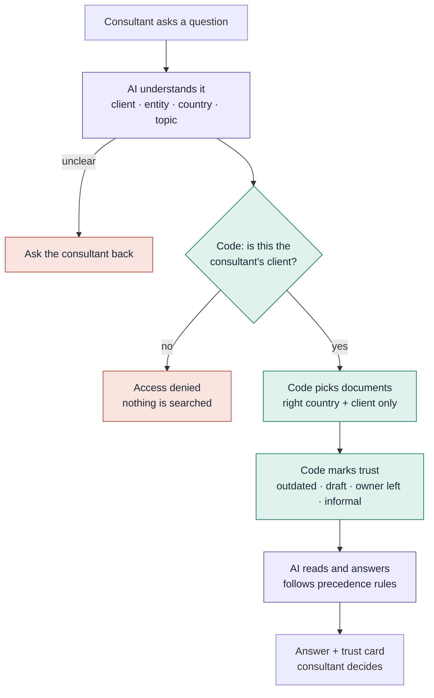
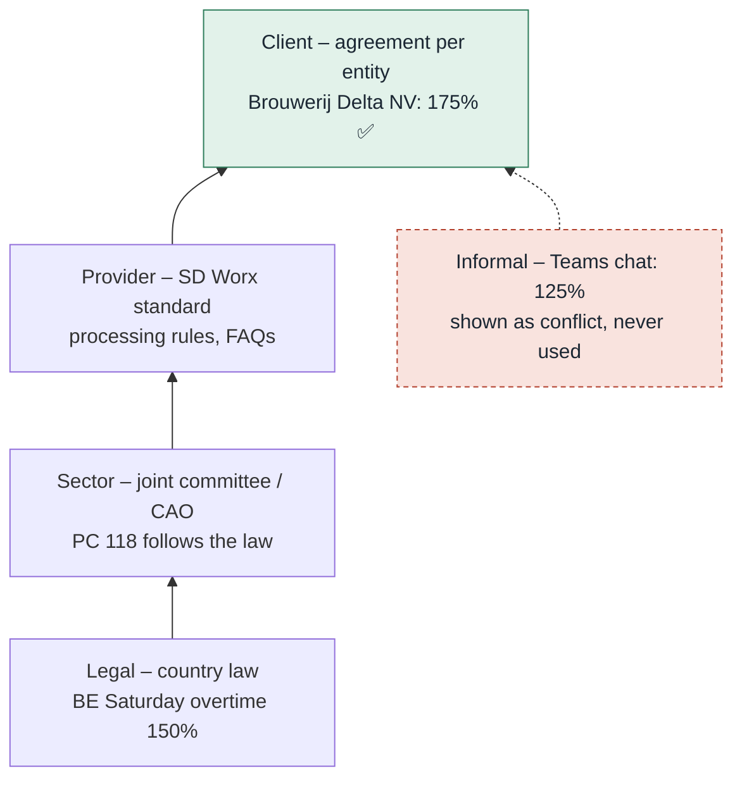
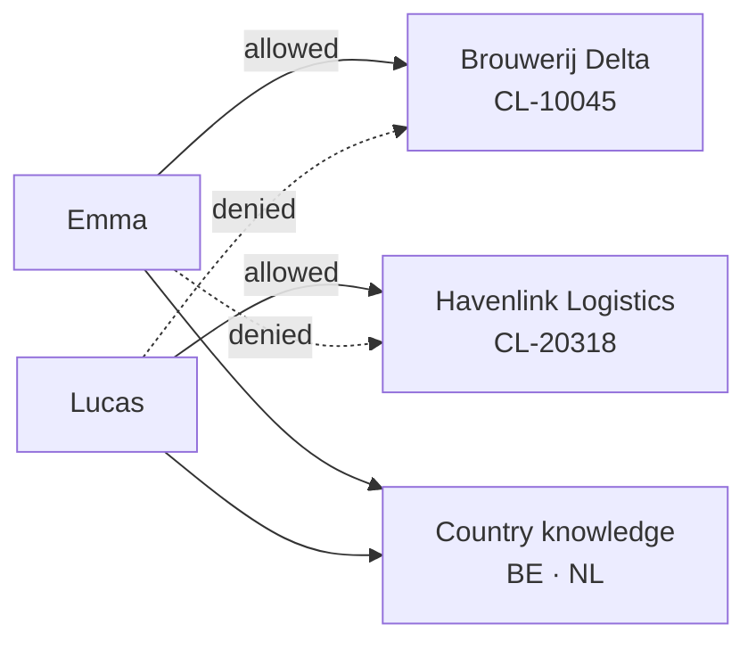

# Trusted Answers

**Payroll answers a consultant can rely on, and a trust card that shows why.**

Built in 4 hours for the **Tectonic Hackathon 2026 – SD Worx challenge: "Unlock the Knowledge Within. Find it. Understand it. Trust it."**

| | |
|---|---|
| **Visual explainer (all diagrams)** | https://claude.ai/artifact/6c7rokWZ9qas3AcRfvHMTT |
| **Demo video (< 3 min)** | _add link_ |
| **Model** | Gemini 3.8 Flash on Google Cloud Agent Platform (Vertex AI) |

> All documents, clients and people in this repository are **fictional demo data**. They are not real SD Worx policies and not legal advice.

---

## The problem

A payroll consultant who just inherited a client gets an urgent question: *"Our Antwerp employee worked 4 extra hours on Saturday. What do we pay?"*

Searching gives five answers: a current policy, an outdated version, a rule for another country, a client agreement, and a Teams chat that says something else. **Finding information is easy. Knowing which answer to trust is the hard part.** That is exactly the moment of doubt SD Worx asked us to solve.

## What Trusted Answers does

The consultant types the customer's question. The agent returns **one answer plus a trust card**:

| Trust card field | Example |
|---|---|
| **Answer** | Saturday overtime at the Antwerp site is paid at **175%** |
| **Confidence** | 🟠 Medium – clear answer, but outdated and conflicting sources exist |
| **Source** | Company agreement, Brouwerij Delta NV (BE) · owner Nina Claes · April 2026 |
| **Why this one** | Client agreement overrides the Belgian standard of 150% for this entity |
| **Ignored** | 2023 policy (replaced, owner left) · Dutch rules (different country) |
| **Conflict** | Teams chat says 125% – based on the outdated policy |
| **Who to ask** | Nina Claes, owner of the agreement |
| **Draft reply** | Ready to copy, reviewed by the consultant before sending |

If no document answers the question, it says **"not found"** instead of guessing. If the question is unclear, it **asks back**. The consultant always decides what goes to the customer.

---

## How it works

Plain code decides **who may see what** and **which documents are outdated**. The AI only understands the question and explains the answer, so it cannot be talked into leaking data.



🟪 AI (Gemini) 🟩 plain code 🟥 stops early

### Which rule wins

Payroll rules stack from general to specific. **The most specific active document wins**, a client agreement applies **only to the legal entity it names**, and chats **never** become the answer.



Also: a **newer version replaces an older one**, and a rule for **another country never applies**.

### Who can see what

Access is checked **in code, before retrieval**. The consultant's identity comes from the login, never from the question text, and a client ID sent from the browser is always re-checked.



---

## The knowledge base

Organised the way payroll providers separate knowledge. The agent reads `catalog.json` first – the map of every document – instead of scanning folders blindly.

```
data/
├── catalog.json          map of every document: country, layer, client, owner,
│                         date, status, supersedes, overrides
├── users.json            which consultant may see which clients
├── knowledge/            👥 all consultants
│   ├── BE/  HR · Payroll · Time · Sector/PC-118
│   └── NL/  HR · Payroll · Time · Sector/CAO-Levensmiddelen
├── clients/              🔒 assigned consultant only
│   ├── CL-10045_brouwerij-delta/     profile · handover note
│   │   ├── BE/Agreements/            Brouwerij Delta NV
│   │   └── NL/Agreements/            Brouwerij Delta B.V.
│   └── CL-20318_havenlink-logistics/ profile · BE agreement
├── informal/             ⚠️ lowest trust
│   ├── teams/            chat export
│   └── uploads/          unverified note (prompt-injection test)
└── shared/               expert directory
```

18 fictional PDFs with **deliberate traps**: an outdated version, an owner who left, a wrong-country rule, two FAQs that disagree, a draft with no owner, and a hidden instruction aimed at the AI.

Regenerate PDFs, catalog and users after editing: `pip install reportlab && python scripts/build_data.py`

---

## Why this solution fits the challenge

Mapped to the judging criteria:

**Originality (30%)** – Most knowledge assistants stop at *"here is an answer"*. Trusted Answers answers *"why should I believe it?"* – the question SD Worx put at the centre of the brief. It shows what it **ignored and why**, surfaces **conflicting colleagues' advice**, and is **honest when confidence is low**.

**Technical ability (30%)** – Metadata-first retrieval: filter by access, country, client entity and trust **before** the AI reads anything. Layered precedence (legal → sector → provider → client), version supersession, per-entity overrides, clarifying questions, and a structured JSON trust card rendered in the UI.

**Fit to the challenge (30%)** – Follows the brief literally: **one role** (payroll consultant), **one moment** (the urgent customer question), taken from SD Worx's own "consultant inherits a portfolio" story. It covers all four inspiration areas:

| SD Worx theme | How we cover it |
|---|---|
| **Trust** – is it reliable and relevant? | Source, owner, date, confidence badge, reason |
| **Capture** – knowledge beyond inboxes | Handover notes and chats included, clearly labelled |
| **Detect** – conflicting, outdated, missing | Flags superseded versions, disagreeing FAQs, drafts, "not found" |
| **Connect** – find the right expert | "Who to ask" from the expert directory |

**Security (10%)** – Access control in code before retrieval, identity from login only, documents treated as data (prompt-injection test included), UI renders plain text only, no secrets in the repo, human in the loop. Audited with Aikido.

---

## Demo scenarios

| # | User | Question | Expected |
|---|---|---|---|
| 1 | Emma | Brouwerij Delta, Antwerp site, 4h Saturday overtime – which rate? | **175%**, medium; ignores outdated + wrong country; flags chat |
| 2 | Emma | Same, for their Breda site | **150%** (Dutch entity) |
| 3 | Emma | Antwerp, Sunday that is also a public holiday | **200%** |
| 4 | Emma | Meal voucher value in Belgium | **€10**; older FAQ (€8) flagged; injected note flagged |
| 5 | Emma | Home-working allowance in Belgium | **Low confidence** – draft, no owner → escalate |
| 6 | Emma | Company car taxation in Belgium | **Not found** – no guessing |
| 7 | Emma | "Saturday overtime rate?" | **Asks** which client or country |
| 8 | Emma | Havenlink Logistics Saturday overtime | **Access denied** – AI never called |
| 9 | Lucas | Havenlink Logistics Saturday overtime | **160%** |

---

## How to run

_Fill in with the final commands._

```bash
git clone https://github.com/XVmecha/Smirnof_drinkers_sd_worx.git
cd Smirnof_drinkers_sd_worx
pip install -r requirements.txt
cp .env.example .env        # then add your values
# start the agent: <command>
# open the UI: src/ui/index.html (set MODE = "api" in the file)
```

`.env` values:

```
GEMINI_API_KEY=        # Google Cloud Agent Platform key (never commit)
GCP_PROJECT=           # your project id
GCP_LOCATION=global
GEMINI_MODEL=gemini-3.8-flash
```

Note: hackathon Google Cloud credentials expire after one week.

## Tech stack

Python · Gemini 3.8 Flash via Google Cloud Agent Platform · pypdf · HTML/JS UI · Aikido security audit

## Limitations and next steps

- Login is simulated with a user switch; production would use SD Worx single sign-on.
- Topic matching uses catalog keywords; at SD Worx scale, add meaning-based search **inside** the already-filtered, access-checked set.
- Conflicts found by the agent could become a review queue for document owners, so outdated knowledge gets fixed at the source.
- _List anything unfinished here._

## Team

_Add names and roles._
