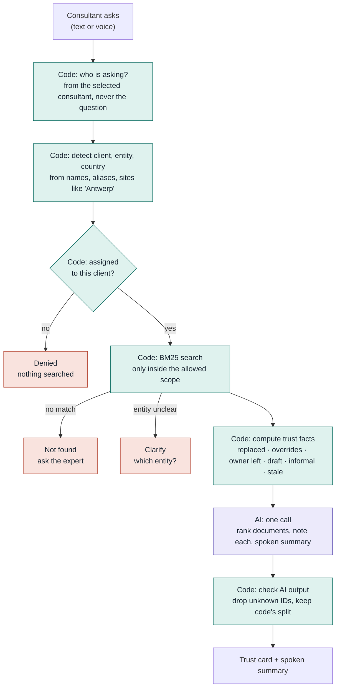
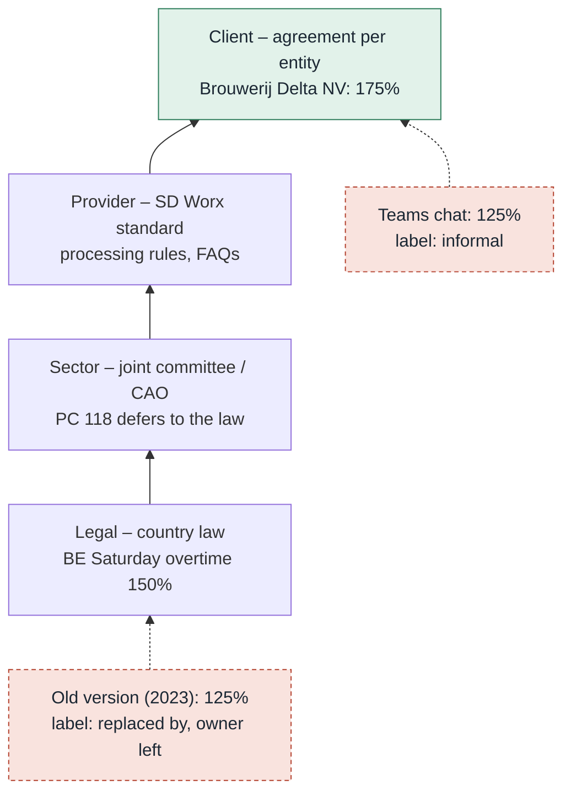
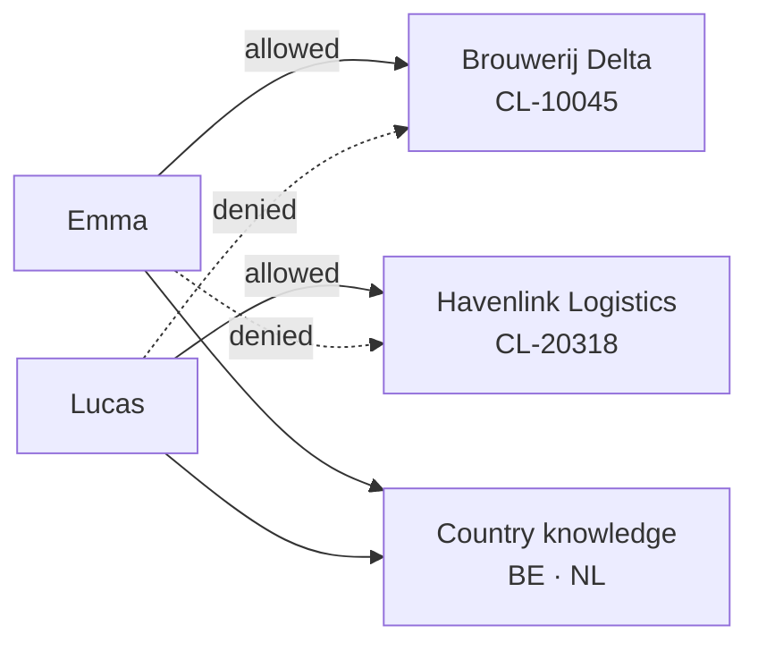

# Trusted Answers

**The rules decide, the AI explains, the consultant verifies.**

A payroll-consultant assistant that doesn't just find documents: it shows which ones apply, which ones are outdated or out of scope, and *why*, so the consultant can trust what they tell the customer.

Built in 4 hours for the **Tectonic Hackathon 2026 – SD Worx challenge: "Unlock the Knowledge Within. Find it. Understand it. Trust it."**

| | |
|---|---|
| **Visual explainer (all diagrams)** | https://claude.ai/artifact/6c7rokWZ9qas3AcRfvHMTT |
| **Demo video (< 3 min)** | _add link_ |
| **Design notes** | [`backend/DESIGN.md`](backend/DESIGN.md) |

> All documents, clients and people in this repository are **fictional demo data**. They are not real SD Worx policies and not legal advice.

---

## The problem

A payroll consultant who just inherited a client gets an urgent question: *"Our Antwerp employee worked 4 extra hours on Saturday. What do we pay?"*

The knowledge base has five candidates: a current legal rule, an outdated version, a rule for another country, a client agreement, and a Teams chat that says something else. An AI assistant that simply summarises them can sound confident and still be wrong. **Finding information is easy. Knowing which source to trust is the hard part.**

## Our answer: make trust visible, not hidden in a model

Most assistants let the AI decide what is true. We split the work:

| Who | Does what | Why |
|---|---|---|
| **Rules (code)** | Who may see which client · which documents are in scope · every trust fact: *replaced by*, *overrides*, *owner left*, *draft*, *informal*, *older than 2 years* | Facts must be the same every time and cannot be talked out of by a prompt |
| **AI** | Ranks the in-scope documents by relevance · writes a one-line note per document · gives a short spoken summary with citations | Language is what AI is good at |
| **Consultant** | Reads the trust card and decides what to tell the customer | A human stays accountable |

The AI **never answers the question on its own authority and never assigns a confidence score.** Same question, same documents, same facts, every time; only the AI's wording varies.

## What the consultant sees

A **trust card** inside a chat interface (Open WebUI), with voice in and out:

- **Scope** – consultant, client entity, country, sector, and how many documents were checked
- **Ranked by relevance** – each document with its **rule-computed labels** (e.g. `overrides BE-TIME-001`, `replaced by BE-TIME-001`, `owner left`, `informal`) and the **AI's note** on why it matters for this question
- **Other country or entity** – documents that look relevant but do not apply (e.g. the Dutch entity's agreement)
- **Suspicious, not ranked** – documents that try to instruct the AI
- **Across documents** – conflicts the AI noticed, e.g. *"three Saturday rates appear (175%, 150%, 125%); the override and supersede links explain all but the informal chat"*
- **Not sure? Ask** – the right expert from the directory
- **Spoken summary** – read aloud (ElevenLabs, or browser voices as fallback)

The card labels which parts are **facts from rules** and which are the **AI's suggestion**, so the consultant always knows what to double-check.

Other outcomes, all decided in code before any AI call:

- **Denied** – the consultant is not assigned to this client; nothing is searched
- **Clarify** – *"Which entity is this for: Brouwerij Delta NV (BE) or Brouwerij Delta B.V. (NL)?"*
- **Not found** – no document covers it; the assistant says so, names who to ask, and does not guess

---

## How it works



🟩 code (deterministic) 🟪 AI (one call, temperature 0) 🟥 stops before the AI

### Which rule applies

Payroll rules stack from general to specific. Code links them (`supersedes`, `overrides`) so the consultant sees *why* one document beats another; a client agreement only applies to the legal entity it names.



### Who can see what

Access is checked **in code before search**. Trust links are computed only inside the consultant's allowed scope, so even a label like *"overridden by CL-20318-…"* cannot leak another client's document ID.



---

## The knowledge base

Organised the way payroll providers separate knowledge. `catalog.json` is the only metadata source; its values are shown to the consultant exactly as stored.

```
data/
├── catalog.json          every document: country, layer, client, entity, owner,
│                         status, date, supersedes, overrides
├── users.json            which consultant is assigned to which clients
├── knowledge/            👥 all consultants
│   ├── BE/  HR · Payroll · Time · Sector/PC-118
│   └── NL/  HR · Payroll · Time · Sector/CAO-Levensmiddelen
├── clients/              🔒 assigned consultant only
│   ├── CL-10045_brouwerij-delta/     profile · handover note
│   │   ├── BE/Agreements/            Brouwerij Delta NV (Antwerp)
│   │   └── NL/Agreements/            Brouwerij Delta B.V. (Breda)
│   └── CL-20318_havenlink-logistics/ profile · BE agreement
├── informal/             ⚠️ lowest trust
│   ├── teams/            chat export
│   └── uploads/          unverified note (prompt-injection test)
└── shared/               expert directory
```

18 fictional PDFs with **deliberate traps**: an outdated version, an owner who left, a wrong-country rule, two FAQs that disagree, a draft with no owner, and a hidden instruction aimed at the AI. Regenerate with `python scripts/build_data.py`; `make docs-push` / `make docs-pull` sync `data/` with a Google Cloud Storage bucket.

---

## Why this fits the challenge

**Originality (30%)** – Most knowledge assistants make the AI the judge of truth. We deliberately don't: rules compute every trust fact, the AI only ranks and explains, and the card labels which is which. That directly answers SD Worx's ask to *"make trust visible, explainable and useful"* and *"not hide complexity behind a black box"*. Voice in and out lets a consultant ask while on a call.

**Technical ability (30%)** – FastAPI backend with context detection (clients, aliases, sites → entity and country), access-scoped BM25 retrieval, computed supersede/override links in both directions, staleness, follow-up questions using chat history, a single temperature-0 AI call with JSON output validated by code, and a provider chain (Groq → Gemini) with model fallbacks. Deployed with Docker Compose.

**Fit to the challenge (30%)** – One role (payroll consultant), one moment (the urgent customer question), taken from SD Worx's own "consultant inherits a portfolio" story. All four inspiration areas:

| SD Worx theme | How we cover it |
|---|---|
| **Trust** – is it reliable and relevant? | Rule-computed labels per document, owner and date, AI note on relevance |
| **Capture** – knowledge beyond inboxes | Handover notes and chat exports included, clearly labelled as such |
| **Detect** – conflicting, duplicated, outdated, missing | *replaced by*, *owner left*, *older than 2 years*, cross-document conflict notes, "not found" |
| **Connect** – the right expert | "Not sure? Ask" from the expert directory |

**Security (10%)** – see below. Audited with Aikido; before/after screenshots in the submission.

---

## Security

- **Access before retrieval** – one scope rule decides the allowed set; unassigned clients are denied and logged before any search or AI call.
- **Identity from the session** – the consultant comes from the selected assistant in Open WebUI (standing in for single sign-on), never from the question text.
- **No cross-client leakage** – trust links are computed inside the scope only.
- **Prompt-injection defence** – document text is escaped inside `<document>` tags; the AI is told it is data; injected documents are listed as suspicious and not ranked. The evaluation label on the test document is never sent to the AI.
- **Allowlisted fields** – only approved catalog fields reach the AI.
- **AI output validated** – IDs the AI was not given are dropped; the in-scope / other-country split stays the code's.
- **Backend hardening** – bound to localhost, optional shared-secret token (constant-time compare), request size limits, API docs endpoints disabled.
- **Safe rendering** – the trust card HTML-escapes every value and only links safe URLs.
- **No secrets in git** – keys live in a git-ignored `.env`.

---

## Demo scenarios

| # | Consultant | Question | Expected |
|---|---|---|---|
| 1 | Emma | Brouwerij Delta, Antwerp site, 4h Saturday overtime – which rate? | BE client agreement (175%) ranked first, `overrides` the legal rule; 2023 version labelled *replaced by, owner left*; Teams chat labelled *informal*; Dutch documents under *Other country or entity* |
| 2 | Emma | Same question for the Breda site | Dutch entity's agreement (150%) in scope, via chat history |
| 3 | Emma | Meal voucher value in Belgium? | Current policy and the older FAQ (*older than 2 years*) with conflicting amounts; injected note under *Suspicious* |
| 4 | Emma | Home-working allowance in Belgium? | Only a *draft* with *no owner* |
| 5 | Emma | Company car taxation in Belgium? | **Not found** – no guessing, names an expert |
| 6 | Emma | "What's the Saturday overtime rate?" | **Clarify** – which client and country |
| 7 | Emma | Havenlink Logistics Saturday overtime? | **Denied** – nothing searched, AI never called |
| 8 | Lucas | Havenlink Logistics Saturday overtime? | Havenlink agreement (160%) ranked first |

Smoke-test from the terminal: `make ask Q="..." AS=U-001`

---

## How to run

Requires Docker.

```bash
git clone https://github.com/XVmecha/Smirnof_drinkers_sd_worx.git
cd Smirnof_drinkers_sd_worx
cp .env.example .env      # set GROQ_API_KEY and/or GEMINI_API_KEY
make up                   # starts Open WebUI + backend
make functions            # installs the Payroll Assistant into Open WebUI
```

Open http://localhost:3000 and pick the Payroll Assistant for **Emma Wouters** or **Lucas Verbeke**.

| Setting | Default |
|---|---|
| LLM order | Groq (`openai/gpt-oss-120b`, fallbacks) → Gemini (`gemini-3.8-flash`, fallbacks) |
| Voice | Whisper (local) speech-to-text; ElevenLabs text-to-speech, falls back to browser voices |
| Mock mode | set `TRUST_API_URL=` (empty) in `.env` to run the UI without the backend |

Useful: `make logs`, `make backend-logs`, `make restart`, `make reset`.

## Tech stack

FastAPI · rank-bm25 · pypdf · Open WebUI · Groq and Gemini (OpenAI-compatible APIs) · Whisper · ElevenLabs · Docker Compose · Google Cloud Storage · Aikido

## Limitations and next steps

- **Domain detection** is not wired yet, so the domain filter is idle ([DESIGN.md](backend/DESIGN.md)).
- The evaluation label `security_test` still sits in `catalog.json`; it should move to a separate test-cases file.
- Login is simulated by choosing the consultant's assistant; production would use SD Worx single sign-on.
- At SD Worx scale, add meaning-based search **inside** the already access-checked scope.
- Conflicts the card surfaces could become a review queue for document owners, so outdated knowledge gets fixed at the source.

## Team

Adam El Khalfioui · Andreas Berentzen · Kishore Kotti
